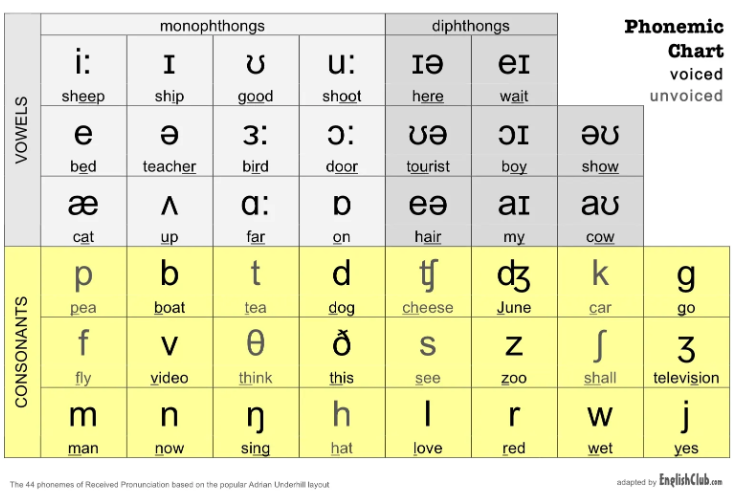

# IPA-Conversion

# What is IPA?

The International Phonetic Alphabet (IPA) is an alphabetic system of phonetic notation primarily based on the Latin script. It allows everyone to learn the pronunciation and standardize the representation of spoken language. 

Example:

 **Input:** How are you?
 
 **IPA Conversion:** haʊ ə˞  ˈju?

# Objective
The phonetic algorithm plays an essential role in many applications- Text-to-speech systems, spelling correction, search recommendations etc. The primary application of natural text-to-IPA conversion is in text-to-speech systems. Text-to-speech systems often rely on IPA conversion to ensure the correct pronunciation of words. By converting natural text or audio into IPA, text-to-speech systems can generate more consistent output that closely matches the intended pronunciation of words. Algorithms were primarily developed for English phonetics, and they perform well for their intended purposes. The above algorithms do not support Bengali Language and show poor performance for Bengali phonetic representation in the English language. 

## Evaluation Method 
Word error rate (WER) is a common metric of the performance of a speech recognition or machine translation system.

S: the number of substitutions.

D: the number of deletions

I: the number of insertion

C: the number of correct words with the Ground Truth

N: the number of words in the Ground Truth

## Challenges 
The most challenging aspect of the competition is that the training dataset does not include Bangla
numerals, whereas the test data contains many sentences with Bangla numerals. Handling numerals poses
a challenge due to the context-dependent representation of numerals in sentences. Numerical values may
be expressed either in numerical form or spelled out as words. The way a phone number is pronounced is not
the same for others such as the amount of money because the phone number is pronounced digit by digit and the
amount of money is pronounced as a whole. Examples:

| Case | Input Sentence                          | Wrong Representation                               | Correct Representation                          |
|------|-----------------------------------------|----------------------------------------------------|------------------------------------------------|
| 1    | I got 10$ from him.                    | I got one zero dollars from him.                  | I got ten dollars from him.                    |
| 2    | His phone number is 67913.             | His mobile number is sixty-seven thousand nine hundred thirteen. | His mobile number is six seven nine one three. |
| 3    | The cost of this product is 34.53$.   | The cost of this product is thirty-four point fifty-three dollars. | The cost of this product is thirty-four point five three. |
| 4    | Boeing-777 is one of the most famous...| Boeing-seven hundred seventy-seven is one of the most famous... | Boeing-seven seven seven is one of the most famous... |

Giving the wrong representation to the IPA conversion model will lead to discrepancies with the Ground Truth, as the evaluation metric is the Word Error Rate (WER) where each substitution, deletion, and insertion contributes to the WER calculation.  Ensuring correct representations is crucial for minimizing errors and achieving higher accuracy in the test dataset.

